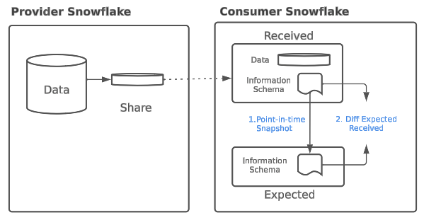

# ShareWatch QuickStart

## Overview
ShareWatch is a streamlit based application installed on consumer of data share's snowflake account. The app detects schema drifts in shares received by consumer.  Share Watch implements schema drift detection and notification which is part of [best practices to operationalize shares](https://docs.google.com/document/d/1PAAw9I_BXwOV8hxPYrWHT5ubbZjUt6t43KWKZK8Kefk/edit) and integrate them in mission critical data pipelines. The app provides a starting point and can be extended to implemenet other best practices discussed in the whitepaper. 

Schema drift occurs where the structure (schema) of shared data is changed over time by the provider. Share Watch detects schema drifts, displays the state of shares on the app and sends email notifications if:   
1. Share is in "Warning" State: schema is appended i.e. new schema, object, or attribute is added to the schema
2. Share is in "Outage" State: schema is altered i.e. An alter, rename, delete, or revoke command on a schema, object, or attribute is performed

Share Watch's "Accept Drift" feature allows for a user to accept changes in schema and make it a new "expected" schema. 

See below diagram for details on how Share Watch detects schema drift 

## Key Features
Share Watch has 2 sections
A) Configuration section - Setup schema drift monitoring on databases mounted from shares, setup email recepient for notifications and setup frequency at which share watch should check for schema drift
B) Monitoring section - Shows status of schema drift on databases mounted from shares

## Prerequisites
- Accountadmin role access in Snowflake or a Snowflake trial account
- Email that alerts are going to go to
- Any shares already from marketplace/private listings (link to guide for adding shares)

## Initial Configuration
- Create a SQL worksheet and paste the SQL script from sf-samples
- Create a Streamlit and paste the Streamlit script

- Run the Initial Configuration from the Streamlit App to set up your initial monitors and task schedule
  - Be careful that this task will initiate a warehouse and could incur costs

## Monitoring Shares
### What Triggers Alerts

### Share Monitor History

#### Remediation

## Configuration Changes
### Changing Task Schedule

### Removing Share Monitors

### Adding Share Monitors

Where to go from here
This tutorial is just a starting point for exploring the possibilities of LLM-powered chat interfaces for data exploration and question-answering using Snowflake and Streamlit. A few next things to try:

Update to run against your private data in Snowflake, or other relevant Snowflake Marketplace datasets. The table-specific logic in the app is all specified at the top of prompts.py, so it should be easy to swap and start playing around!
Add more capabilities, such as using the LLM to choose from a set of available tables, summarize the returned data, or even write Streamlit code to visualize the results. You could even use a library like LangChain to convert Frosty into an "Agent" with improved chain of thought reasoning and the ability to respond to errors.
Prepare to run in Streamlit in Snowflake (currently in Private Preview): The functionality shown here will soon be available in Streamlit in Snowflake, especially when paired with External Access (also in Private Preview) to simplify access to an external LLM.
Check out the Frosty session (ML103) from Snowflake Summit 2023 for more ideas and what's coming soon from Snowflake!

Additional resources
Want to learn more about the tools and technologies used by your app? Check out the following resources:

Streamlit's new chat UI
st.experimental_connection
Session state
Secrets management
OpenAI's ChatCompetion feature
Generative AI and Streamlit: A perfect match
Build powerful generative AI apps with Streamlit
Demo on Snowflake Demo Hub